 <!--## Hi there 👋

**maleehanaz23/maleehanaz23** is a ✨ _special_ ✨ repository because its `README.md` (this file) appears on your GitHub profile.
---
Here are some ideas to get you started: -->
 <!-- HEADER -->

  <h1>Hi there, I'm Maleeha Naz 👋</h1>
  

## 🚀 About Me 

- 🔭 I’m currently working on : Web Development
- 🌱 I’m currently learning : React.js and Next.js to take my front-end skills to the next level.
- 👯 I’m looking to collaborate on : Open-source contributions and innovative web solutions.
- 💬 Ask me about : Front-end Web Development
- 📫 How to reach me: (https://www.linkedin.com/in/maleeha-naz-81254623b/)
- 😄 Pronouns: She/Her
- ⚡ Fun fact: I built a currency converter to save money on trips — now I just keep building it for fun. 💱✨

  ---

## 🌐 Social Links 

  

  
  
 <!-- </a>
  -->

<!--  -->

---

## 🎬 Fun Coding 

  

---

##  Languages and frameworks

   
   
   
   
   
   
   
   
   
   
   
   
   
   
  

---

*Tools & Databases:*  

  
  
  
  

  ---

  *Version Control & Collaboration:*  

  
  

  ---

## 📈 GitHub Stats 

  <!-- -->
 
  
  
  
  
  <!--  -->
  
  
  <!-- [Top Langs](https://github-readme-stats.vercel.app/api/top-langs/?username=maleehanaz23&layout=compact&theme=vision-friendly-dark) -->
  

---

## 🏆 Trophies 

<!--  -->

---

## 👪Contributions

---

<!--  Motto Card -->
<h3 style="margin:0 0 10 0;">💡 MY MOTTO</h3>

    

        "Keep learning, keep building, and let your code tell your story."
    

---

 
